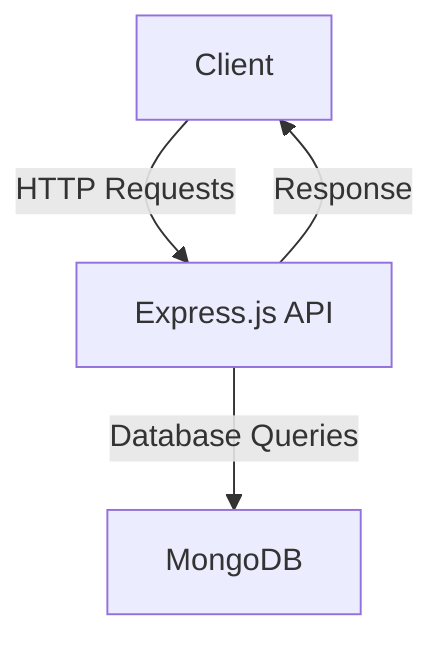

# User Authentication and Management API

## Description
This API handles user authentication, signup, login, password recovery, and user management. Below is a detailed explanation of each endpoint.

---

## Endpoints

### Authentication Endpoints

#### 1. **POST** `/api/v1/auth/signup`
**Description**: Creates a new user account.
**Request Body**:
- `email`: User's email (required).
- `password`: User's password (required).
- `name`: User's name (required).
- `phone`: User's phone (required) => EG || SR
- `role`: User's role (required). and Default `user`

#### 2. **POST** `/api/v1/auth/login`
**Description**: Logs in a user.
**Request Body**:
- `email`: User's email (required).
- `password`: User's password (required).

#### 3. **POST** `/api/v1/auth/forgotPassword`
**Description**: Sends a password reset code to the user.
**Request Body**:
- `email`: User's email (required).

#### 4. **POST** `/api/v1/auth/verifyResetCode`
**Description**: Verifies the password reset code sent to the user.
**Request Body**:
- `passwordResetCode`: Code sent to the user's email (required).

#### 5. **POST** `/api/v1/auth/resetPassword`
**Description**: Resets the user's password.
**Request Body**:
- `Newpassword`: New password (required).

---

### Admin-Only User Management Endpoints

#### 6. **GET** `/api/v1/users`
**Description**: Fetches a list of all users.

#### 7. **POST** `/api/v1/users`
**Description**: Creates a new user account (admin-created).
**Request Body**:
-   `name` ,`email`, `password`, `phone` , `role` , and other user details (required).

#### 8. **POST** `/api/v1/users/:id`
**Description**: Updates specific fields for a user.
**Request Params**:
- `id`: User ID (required).

#### 9. **PUT** `/api/v1/users/:id`
**Description**: Fully updates a user's information.
**Request Params**:
- `id`: User ID (required).

#### 10. **DELETE** `/api/v1/users/:id`
**Description**: Deletes a user account.
**Request Params**:
- `id`: User ID (required).

---

### General User Endpoints

#### 11. **GET** `/api/v1/users/getMe`
**Description**: Retrieves the currently logged-in user's account details.

#### 12. **PUT** `/api/v1/users/updateMyPassword`
**Description**: Updates the logged-in user's password.
**Request Body**:
- `password`: New password (required).

#### 13. **PUT** `/api/v1/users/updateMy`
**Description**: Updates the logged-in user's account data (excluding password).
**Request Body**:
- Any user fields to be updated.

#### 14. **DELETE** `/api/v1/users/deleteMy`
**Description**: Deactivates the logged-in user's account.

#### 15. **POST** `/api/v1/users/activeMe`
**Description**: Reactivates a deactivated user account.

---

## Application Diagram

### Tech Stack
-   
  **JavaScript**: Language used for backend logic.

-   
  **Node.js**: Runtime environment for executing JavaScript.

-   
  **Express.js**: Web framework for building the API.

-   
  **MongoDB**: Database for storing user data.

### System Overview


---

## Installation

1. Clone the repository:
   ```bash
   git clone https://github.com/AbdelrahmanMahmmed/Authentication-Authorization-Nodejs-Expressjs-Mogodb
   cd Authentication-Authorization-Nodejs-Expressjs-Mongodb
   ```

2. Install dependencies:
   ```bash
   npm install
   ```

3. Create a `.env` file in the root directory and add:
   ```env
    PORT= 5000 <`Your Port on Run App`>
    NODE_ENV= <`The situation the worker is in`>
    DB_CONNECT= <`Database Connection`>
    JWT_SECRET_KEY= <`SECRET Key for JWT `32-Digit is preferred` `>
    JWT_EXPIRES_TIME= <`Time during which Token will invalid`>
    AUTH_USER_SEND_EMAIL= <`User when Send Email`>
    AUTH_PASSWORD_SEND_EMAIL= <`Password when Send Email`>
    AUTH_HAST_SEND_EMAIL= <`hast when Send Email`>
    AUTH_PORT_SEND_EMAIL= <`port when Send Email`>

   ```

4. Start the application:
   ```bash
   npm run start:dev
   ```
## Thank You!

We are grateful for your support and interest in our project. If you have any questions or feedback, feel free to reach out to us. We hope you find this project useful, and we are always looking to improve and enhance it. Thank you for your time and contributions!
